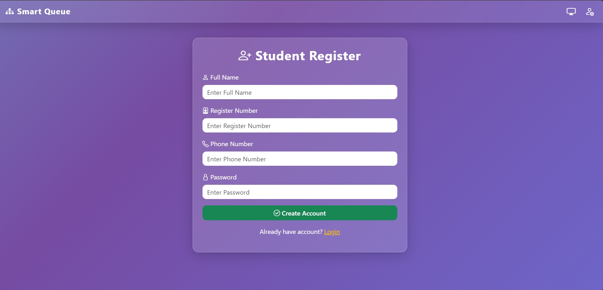
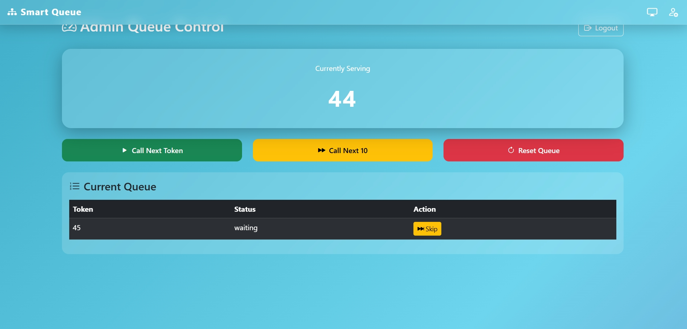
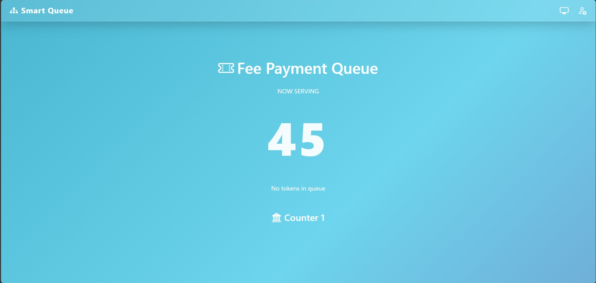
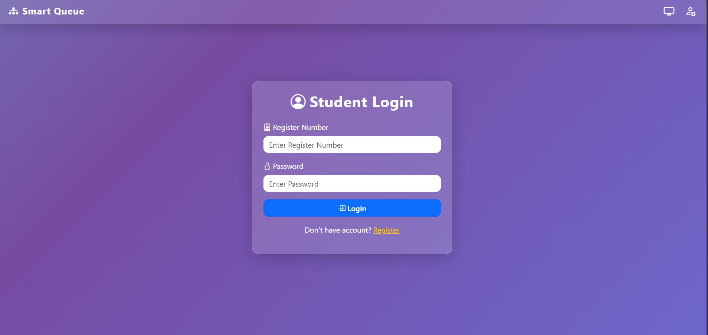

## 🚀 Smart Queue Management System for College Fee Payment

A **full-stack MERN application** that digitizes the fee payment queue in college accounts offices.

Students can generate **digital tokens**, track their position in the queue, and receive **real-time updates and SMS notifications**.

Admins can manage the queue using a **control dashboard**, and a **public display board** shows the current token on a monitor.

---

## 🌐 Live Demo

👉 https://smart-queue-management-system-sage.vercel.app/

---

## 👨‍💻 Author

**Praveen Kumar**  
🔗 https://www.linkedin.com/in/praveenkumar65/  
🔗 https://github.com/Praveenkumar-in  

---

## 🛠️ Tech Stack

### Frontend
- React (Vite)
- Bootstrap 5
- Bootstrap Icons
- Socket.io Client
- Axios
- React Router

### Backend
- Node.js
- Express.js
- MongoDB (Mongoose)
- Socket.io
- JWT Authentication
- SMS Integration (Fast2SMS)

### Deployment
- Vercel (Frontend)
- Render (Backend)
- MongoDB Atlas (Database)

---

## ✨ Features

### 👤 Student
- Student Registration & Login  
- Generate Digital Token  
- View Queue Position  
- See Students Ahead  
- Estimated Waiting Time  
- Real-time queue updates  
- SMS notification on token generation  
- SMS alert when turn is near  

---

### 👨‍💼 Admin
- Admin Login  
- Call Next Token  
- Call Next 10 Tokens  
- Skip Token  
- Reset Queue  
- View Queue List  
- Real-time dashboard updates  
- Monitor display control  

---

### 📺 Public Display Board
Designed for **large monitor / TV display**

- Current token being served  
- Upcoming tokens  
- Counter information  
- Live updates using WebSockets  

---

## 🖼️ Screenshots

### 🔐 Admin Login


### 📝 Registration Page


### 👤 Student Dashboard / Token Generate


### 🎟 Token Status View


### 👨‍💼 Admin Dashboard


### 📺 Display Board


### 📸 login View


---

## 📁 Project Structure

```
smart-queue-management
│
├── backend
│   ├── config
│   │   └── db.js
│   ├── controllers
│   ├── models
│   ├── routes
│   ├── middleware
│   ├── services
│   ├── socket
│   ├── server.js
│   └── package.json
│
└── frontend
    ├── src
    │   ├── components
    │   ├── pages
    │   ├── services
    │   ├── socket
    │   ├── App.jsx
    │   └── main.jsx
```

---

## 🔗 API Endpoints

### Authentication
```
POST /api/auth/register
POST /api/auth/login-student
POST /api/auth/login-admin
```

### Token System
```
POST /api/token/generate
GET  /api/token/status
GET  /api/token/queue
```

### Admin Controls
```
POST /api/admin/call-next
POST /api/admin/call-next-10
POST /api/admin/skip
POST /api/admin/reset
```

---

## ⚡ Real-Time Events (Socket.io)

```
queueUpdated
tokenGenerated
tokenCalled
queueReset
```

These events update:
- Student dashboard  
- Admin dashboard  
- Display board  

---

## ⚙️ Installation & Setup

### Backend
```
cd backend
npm install
node server.js
```

### Frontend
```
cd frontend
npm install
npm run dev
```

---

## 🔐 Environment Variables

### Backend (.env)

```
PORT=5000
MONGO_URI=your_mongodb_uri
JWT_SECRET=your_secret_key

FAST2SMS_API_KEY=your_api_key

ADMIN_EMAIL=admin@gmail.com
ADMIN_PASSWORD=admin123
```

---

## 🚀 Deployment

### Frontend → Vercel
- Import GitHub repo  
- Select `frontend` folder  
- Deploy  

### Backend → Render
- Create Web Service  
- Set root directory: `backend`  
- Start command:
```
node server.js
```

---

## 🔮 Future Improvements

- 🔊 Voice announcement for tokens  
- 🏢 Multi-counter support  
- 📱 Mobile PWA app  
- 📊 Queue analytics dashboard  
- 🔔 Smart SMS reminders  

---

## 📜 License

⚠️ This project is protected under **All Rights Reserved**.  
Unauthorized copying or usage is strictly prohibited.